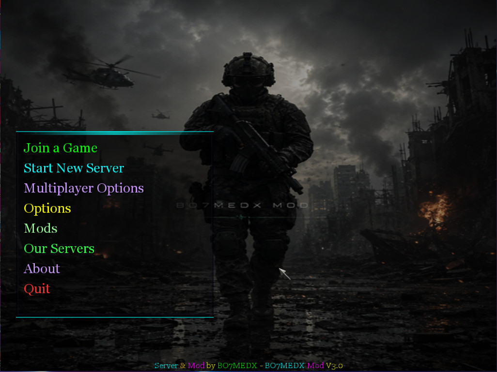
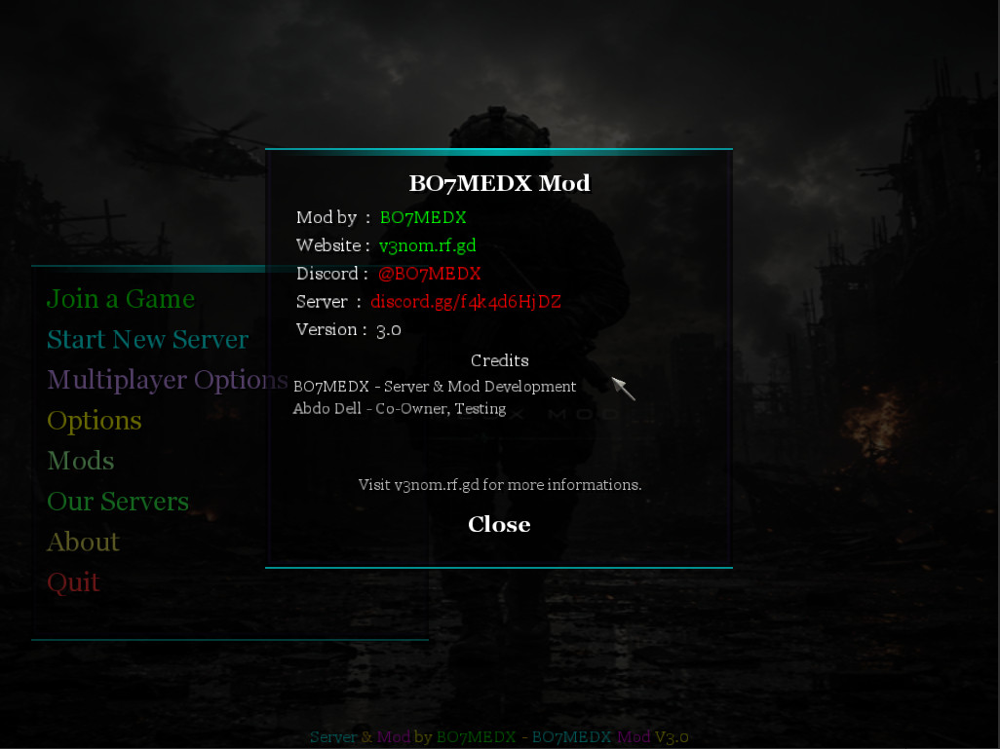
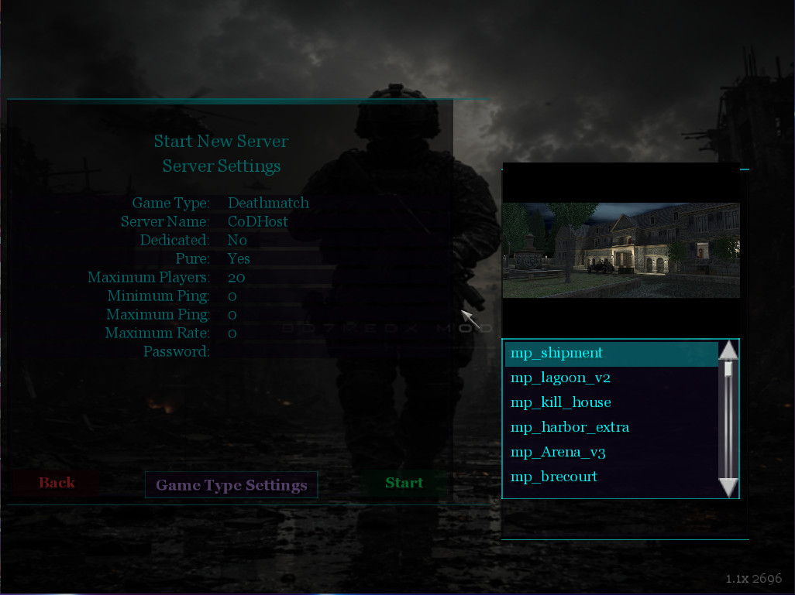
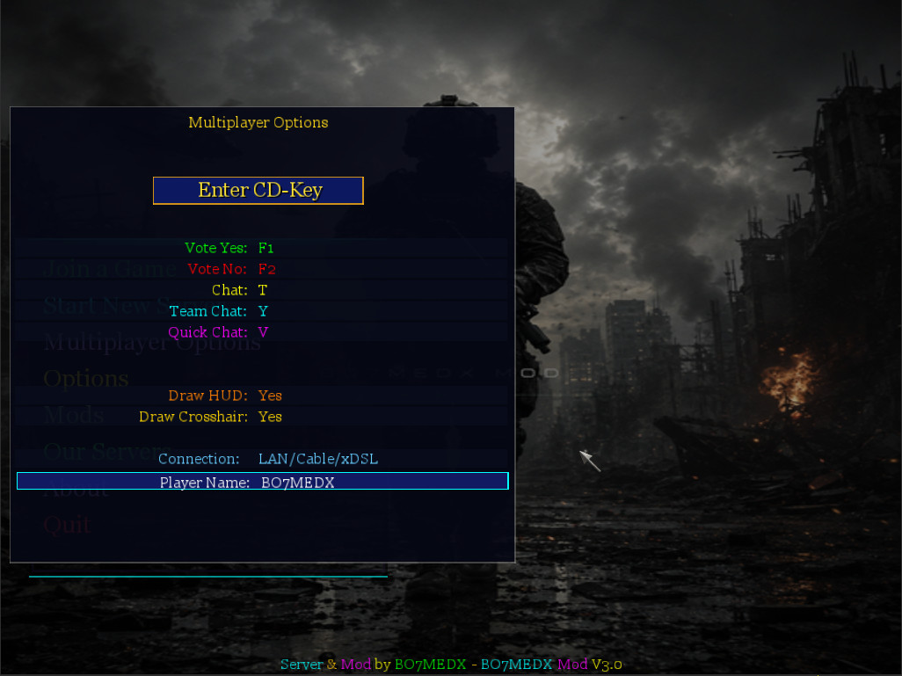
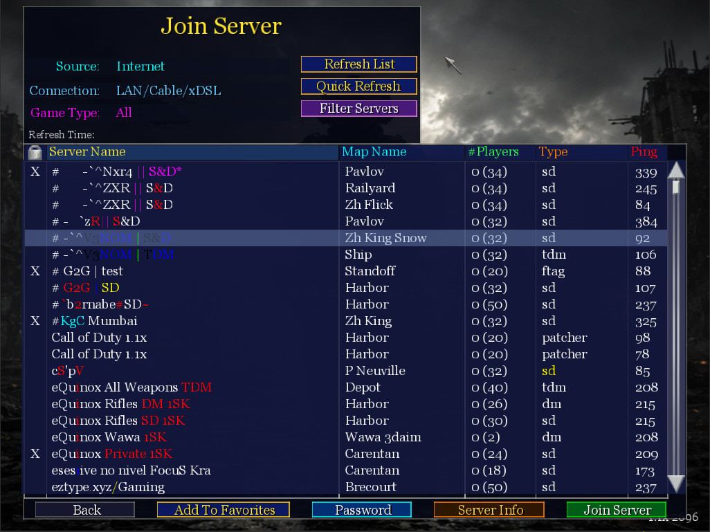
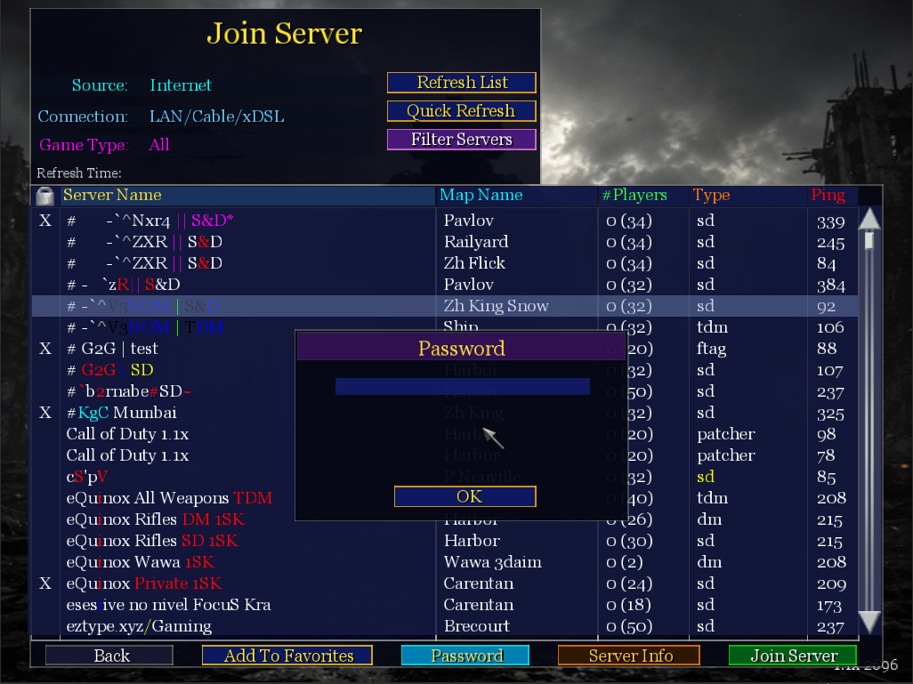
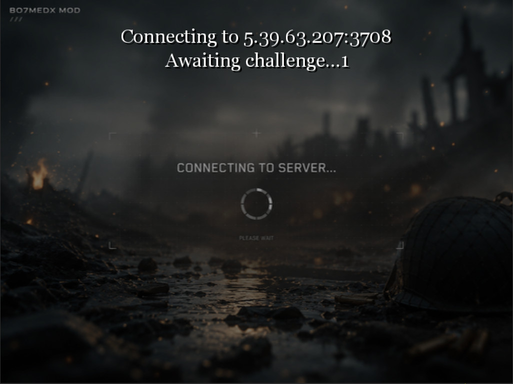
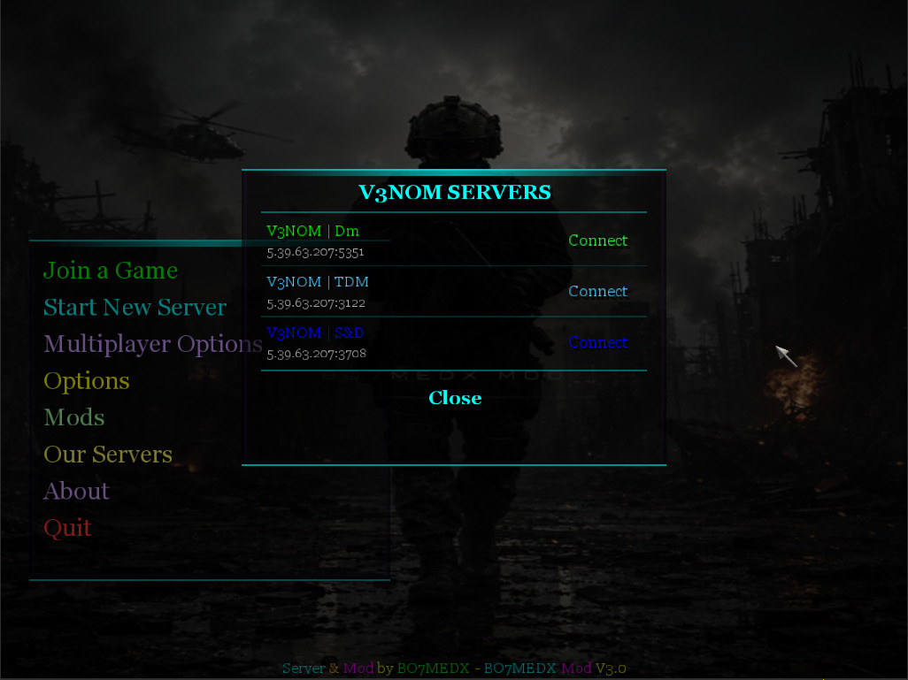

# Call of Duty 1 - Custom UI Overhaul

A full user interface overhaul for Call of Duty 1 (2003) with redesigned menus, custom vibrant text colors, and a modern layout. 

---

## Screenshots

<table>
  <tr>
    <td></td>
    <td></td>
  </tr>
  <tr>
    <td></td>
    <td></td>
  </tr>
  <tr>
    <td></td>
    <td></td>
  </tr>
  <tr>
    <td></td>
    <td></td>
  </tr>
</table>

---

## How to Install

1. [Click here to download the mod file directly](https://github.com/bo7med-x/cod1-ui-remake/releases/download/last/zzz_bo7medx_ui_v2.pk3).
2. Go to your Call of Duty 1 installation folder.
3. Open the `main` directory.
4. Drop the `.pk3` file inside it.
5. Run the game.

---

## Contributing

Contributions are welcome! If you want to improve the UI, fix bugs, or add new features, feel free to fork this repository and submit a pull request.

---

## Credits

* **Remake Creator:** BO7MEDX
* **Discord:** @BO7MEDX
* **Discord Server:** https://discord.gg/VwZhDcbehx

---

## License

This project is open-source and available under the [MIT License](LICENSE). Anyone is free to use, modify, and distribute the code and assets, provided that proper credit is given to the original creator.
